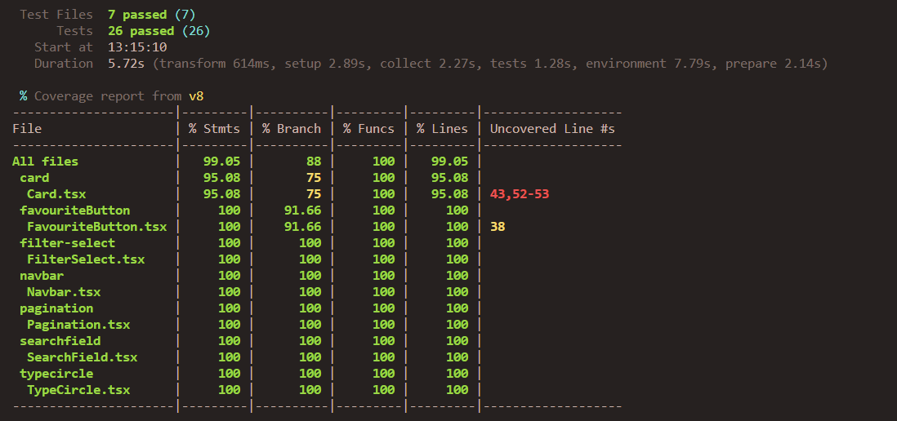

# IT2810 Prosjekt 1

This is group 15s submission for project 1 in the course IT2810.

The application is a tool for gathering information about pokemons. You can find different pokemon by navigating through pages, filter by color or a search by specific name or pokedex-number. The information shown about a pokemon includes statistics such as height, weight, abilities, types and other base statistics, as well as an image of the pokemon.

You can also favourize a pokemon by clicking a star button, for providing easier access through the favourites-page later on.

## Installation

1. Clone the repository
2. Run `npm install` in the root folder
3. Run `npm run dev` in the root folder

## Linting

We use eslint to lint our code. To run the linter, run `npm run lint` in the root folder.

## Testing

We used vitest for DOM, snapshot and Unit-testing. To run the tests, run `npm run test` in the root folder.
To check the test-coverage, run `npm run coverage` in the root folder.

As shown below in the coverage report, we have 26 tests and 7 files. Each file is correspondent to a component to be tested and we have tested the following components, with the described tests:

- Card
  - Snapshot test
  - Renders pokemon name and number
  - renders pokemon image
  - navigates to pokemon page on click
- FavouriteButton
  - Snapshot test
  - Renders component
  - Adds pokemon to favourites on click
  - Changes style on click
- Filter-Select
  - Snapshot test
  - Render test
  - Can change option
- Navbar
  - Snapshot test navbar
  - Render test
  - Navigate to home
  - Navigate to favorites-page
- Pagination
  - Snapshot test
  - Render test
  - Navigate to next page
  - Navigate to previous page
- Searchfield
  - Snapshot test
  - Render test
  - Change textfield value
  - Correct navigation on search submit
  - Case sensitivity test

## API-usage

The Restful API we chose for the project is called [PokeAPI](https://pokeapi.co/docs/v2). This API provides easy access to statistics for pokemons.
